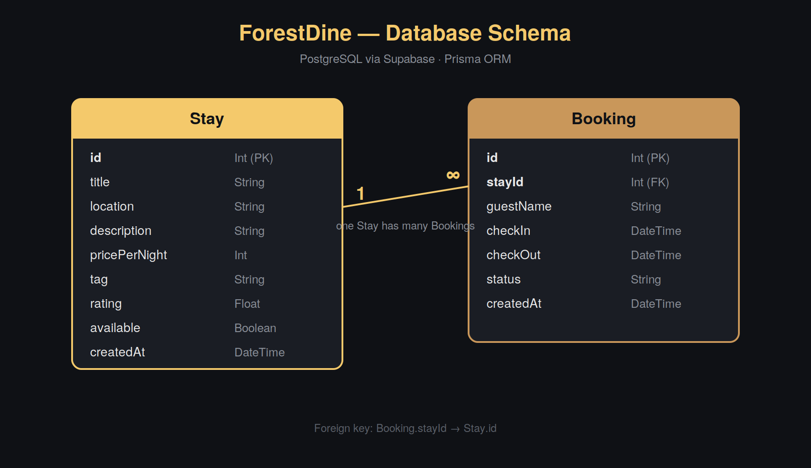

# ForestDine

Homestays and forest dining, booked directly from the people who host them.

ForestDine connects travelers with small eco-homestays and farm-to-table dining experiences in forest and hill regions — without a hotel chain in between.

## Tech Stack

- **Frontend:** Next.js (App Router) + TypeScript
- **Styling:** Tailwind CSS
- **Backend:** Coming soon
- **Database:** Coming soon
- **Auth:** Coming soon
- **Deployment:** Vercel (planned)

## Project Structure

```
src/
  app/             # routes (Home, About, Dashboard, Login)
  components/      # Navbar, Hero, Card, Footer, CanopyDivider
```

## Getting Started

```bash
npm install
npm run dev
```

Open [http://localhost:3000](http://localhost:3000).

## Setup — coming soon

Backend, database, and authentication setup instructions will be added once those layers are built in upcoming weeks.

## How to run backend locally

```bash
cd backend
npm install
cp .env.example .env
npm run dev
```

API runs on `http://localhost:5000`. Endpoints:

| Method | Endpoint | Description |
|--------|----------|-------------|
| GET | /api/health | Health check |
| GET | /api/stays | List all stays |
| GET | /api/stays/:id | Get single stay |
| GET | /api/stays/search?q= | Search stays |
| POST | /api/stays | Create a stay |
| PUT | /api/stays/:id | Update a stay |
| DELETE | /api/stays/:id | Delete a stay |
| GET | /api/bookings | List all bookings |
| POST | /api/bookings | Create a booking |
| PATCH | /api/bookings/:id/status | Update booking status |

## Database (Week 5)

**Choice: PostgreSQL via Supabase, using Prisma as the ORM.**

ForestDine's data is clearly relational — every Booking belongs to exactly one Stay, and there's no need for flexible/variable schemas the way a document store would offer. Postgres lets the database itself enforce that a booking can never reference a stay that doesn't exist (via a foreign key), which would otherwise have to be manually checked in application code. Prisma was chosen over a raw pg client because it gives type-safe queries and handles migrations automatically as the schema evolves.

### Schema



- **Stay** — id, title, location, description, pricePerNight, tag, rating, available, createdAt
- **Booking** — id, stayId (FK -> Stay.id), guestName, checkIn, checkOut, status, createdAt
- Relationship: one Stay has many Bookings.

### Set up the database

1. Create a free project at supabase.com.
2. Go to Connect -> ORM tab -> .env.local and copy the DATABASE_URL and DIRECT_URL connection strings.
3. Paste them into backend/.env (see backend/.env.example for the expected format).
4. Install dependencies and run the migration:
```bash
   cd backend
   npm install
   npx prisma migrate dev --name init
```
5. (Optional) Seed sample data: `node prisma/seed.js`
6. Start the server: `npm run dev`

All 9 API endpoints (6 for /api/stays, 3 for /api/bookings) now read from and write to Postgres instead of the old in-memory data.js.
